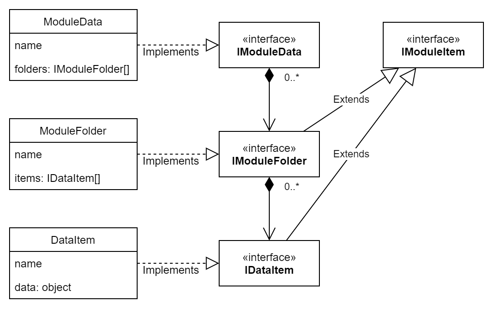

# lilo-pim-vue
Demo of Personal Information Manager, created in VueJS.

## Technologies
- Vue
- TypeScript
- Vuetify
- PWA
- Markdown

## Features
- Offline access
- Pluggable views
- Markdown support for styling text content
- Mobile first, responsive design
- Multi language support (currently English and Hebrew)
- Themable (light and dark theme provided, can create a custom theme)

## Design

### Data layer
This layer represents the api to the server and the data that it supplies.

